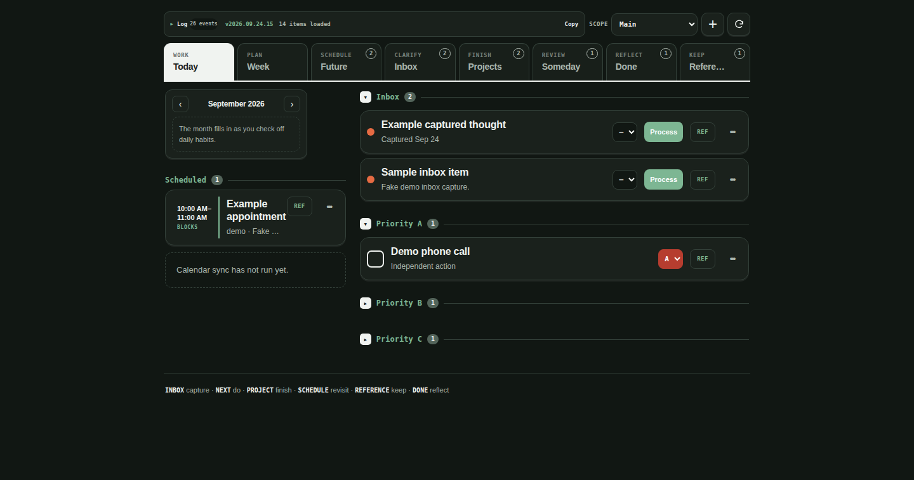
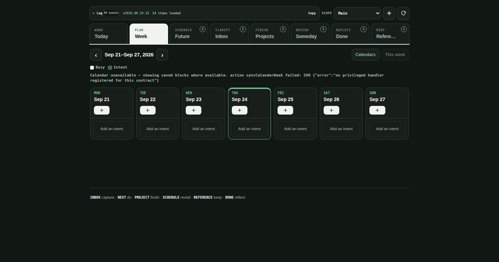
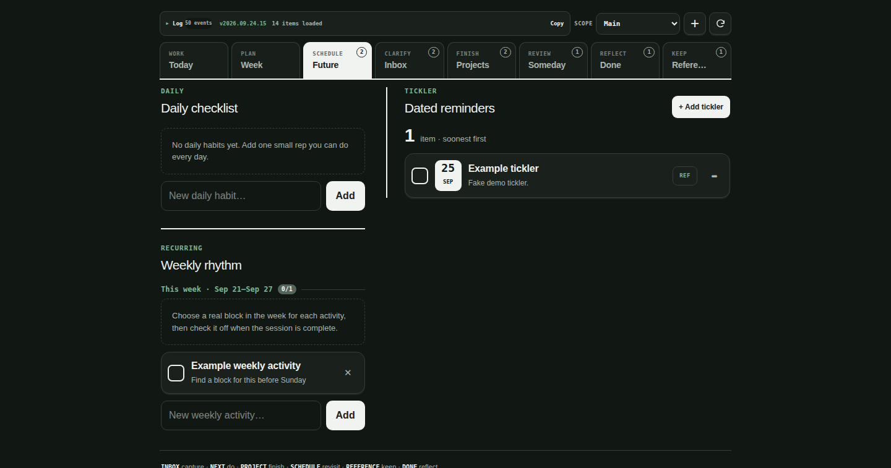
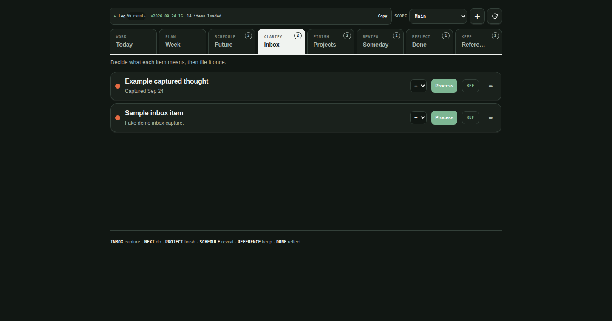
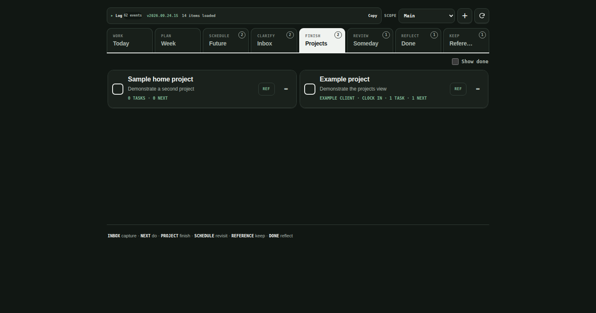
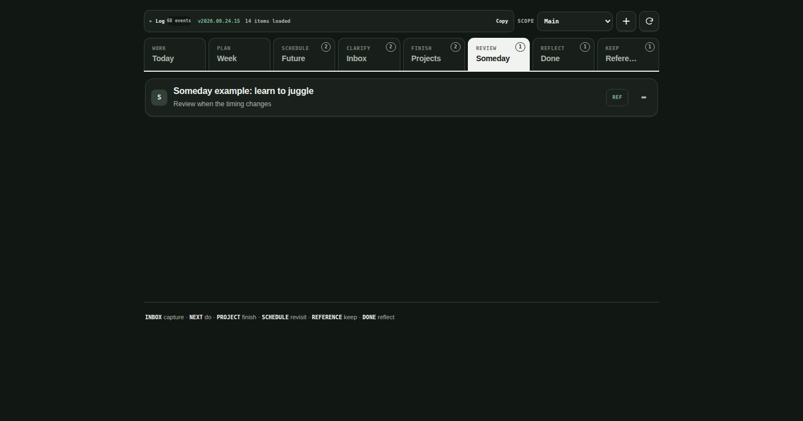
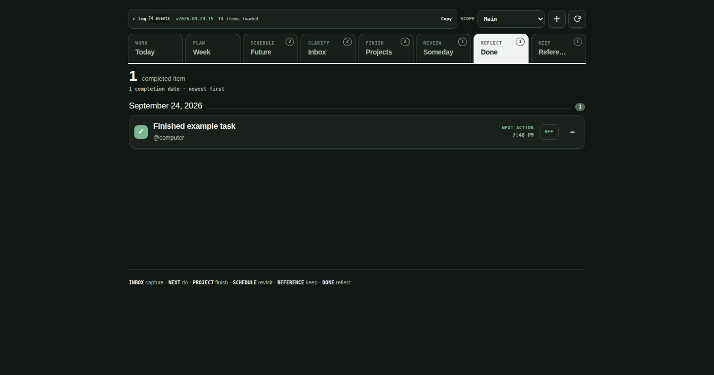
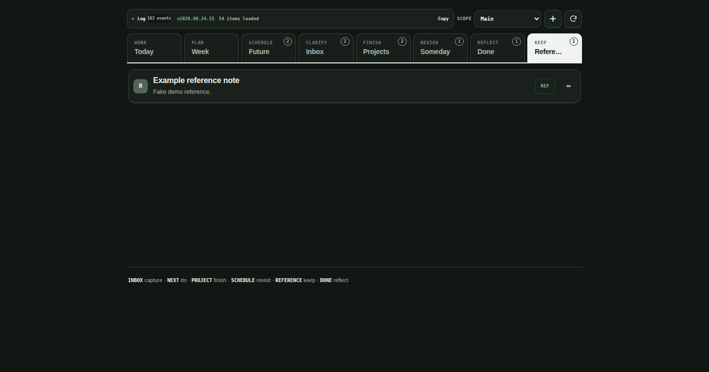

# muse-gtd

A personal [GTD](https://en.wikipedia.org/wiki/Getting_Things_Done) task-management web app: a full-stack TypeScript build with a React client, Bun server actions, and SQLite (Drizzle) storage. It was built as a Muse web artifact; this repo is the standalone source so other people — and their Muses — can run their own copy.

## What it does

- **Today (WORK)** — daily checklist, scheduled items, and next actions in collapsible sections (Inbox, Unprioritized, Priority A/B/C), with empty sections hidden.
- **Week (PLAN)** — a Monday–Sunday planning view over Google Calendar: your primary calendar read-only, plus an editable "intent" calendar for soft time-blocking (created transparent with reminders) and a third read-only calendar, each toggleable.
- **Future (SCHEDULE)** — daily checklist, recurring routines, and ticklers, soonest first.
- **Inbox** — rapid capture; triage items into actions, projects, ticklers, reference, or someday.
- **Projects, Someday, Reference, Done** — the rest of the GTD system; Done is grouped by completion date, newest first.
- Items support URLs as a separate click target, per-item details, and priority levels.

## Quickstart

Prerequisites: [Bun](https://bun.sh) 1.3.10 or newer.

```bash
bun install
cp server/src/local-config.example.ts server/src/local-config.ts
# edit server/src/local-config.ts: fill in your three Google Calendar IDs
bun run check:local-config   # fails fast if the file is missing or incomplete
bun run db:migrate            # create ./app.db (override with GTD_DB=/path/to.db)
bun run build:standalone      # build the client bundle into client/dist
bun run serve:standalone      # serve the app on http://127.0.0.1:8479
```

If `server/src/local-config.ts` is missing or incomplete, the config check fails
fast with a clear message telling you what to fill in. (The `bun run build`
script — config check, test suite, server + client builds — is the Muse
web-artifact builder pipeline and runs under `artifact.edit`; for local runs
use the `db:migrate` / `build:standalone` / `serve:standalone` scripts above.)

Your data lives in `app.db` (SQLite, created at runtime, git-ignored). The schema is in `schema.sql`, with Drizzle migrations under `drizzle/`. Your real `local-config.ts` is git-ignored too — only the `.example.ts` template is committed, so cloning this repo never leaks anyone's identifiers.

## About `@hatch/space-sdk`

The app's action contracts are written against the Muse web-artifact
runtime's `@hatch/space-sdk`, resolved via
`file:/opt/hatch/skills/spaces/ts-runtime/dist/space-sdk.tgz` — that path
exists on every Muse runtime, so `bun install` just works there. (There is
no need to vendor or replace it; other people's Muses run the same runtime.)

## For Muse agents

This deploys as a Muse web artifact (see `space.json`: entry `client/dist/index.html`, server actions `server/dist/actions.js`, TypeScript runtime). Google Calendar reads/writes go through the platform's privileged calendar integration — the three calendar IDs in `server/src/local-config.ts` tell it which calendars to use:

- `primary` — your main Google calendar (usually your Gmail address), read-only in the app.
- `intent` — a calendar you own for soft time-blocking; the only writable calendar.
- `tangentcode` — a third read-only calendar (any group calendar ID works; rename the concept to fit your life).

`AGENTS.md` documents the artifact's build conventions and hard-won lessons (version discipline, release process, health checks). `DATA-PLAN.md` describes the data model.

## Screenshots

Captured in dark mode against a clean demo database (fake data, no real
calendar connected — the Week view shows its honest "calendar unavailable"
state without Google credentials):

| View | Screenshot |
| ---- | ---------- |
| Today — inbox triage, priorities, scheduled blocks |  |
| Week — Mon–Sun grid with intent blocks |  |
| Future — daily checklist, tickler, weekly rhythm |  |
| Inbox — capture triage |  |
| Projects — project cards with next actions |  |
| Someday — maybe-later list |  |
| Done — completed items by date |  |
| Reference — notes and links |  |

## License

MIT — see [LICENSE](LICENSE).
